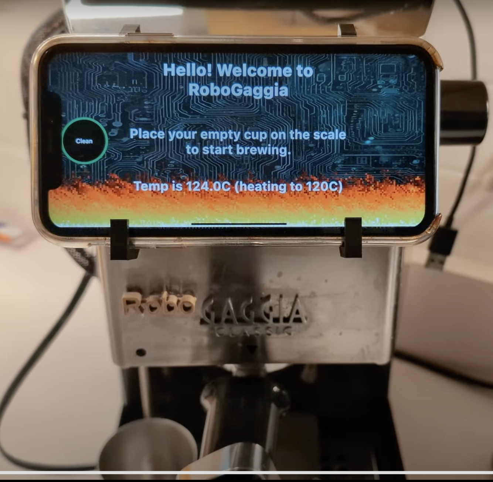

# Robo Gaggia Simulator 

[Nick DiPatri](ndipatri@gmail.com)

[LinkedIn](https://www.linkedin.com/in/ndipatri/)

## MQTT Testing Harness ##

This desktop-based simulator pretends that it is the Robo Gaggia device: it emits telemetry and changes state as commands are sent by the [Robo Gaggia Multiplatform Mobile Application](https://github.com/ndipatri/RoboGaggiaMultiplatform) using MQTT.

This desktop app is built using [Compose Multiplatform UI Framework](https://www.jetbrains.com/lp/compose-multiplatform/) technology.  It is JVM-based.

This simulator also represents each 'state' of Robo Gaggia by playing a video clip taken from the real Robo Gaggia.

The video file is large enough that in order to store it in this repository, I have to use **GitHub Large File System (LFS)***.  If you want to check this video file out along with this repository you will need to [follow these instructions for installing GitHub Large File Storage support](https://docs.github.com/en/repositories/working-with-files/managing-large-files/installing-git-large-file-storage)

## MQTT Broker ##

Before you run this desktop application, you must run the [MQTT Broker](mqtt/mqttBroker.sh) script.  Both the [Robo Gaggia Multiplatform Mobile Application](https://github.com/ndipatri/RoboGaggiaMultiplatform) and this simulator communicate via this local broker. 

## Additional Notes ##

Like all simulators, this one must be updated as the behavior of the real [Robo Gaggia](https://github.com/ndipatri/RoboGaggia) is changed.

