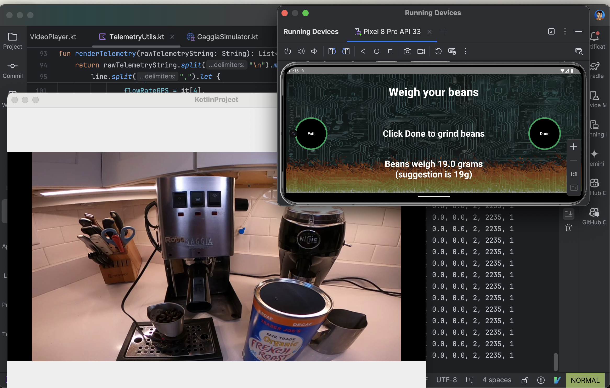

# Robo Gaggia Simulator 

[Nick DiPatri](ndipatri@gmail.com)

[LinkedIn](https://www.linkedin.com/in/ndipatri/)

## MQTT Testing Harness ##

This desktop-based simulator, shown in the bottom left in above image, pretends that it is the Robo Gaggia device: it emits telemetry and changes state as commands are sent by the [Robo Gaggia Multiplatform Mobile Application](https://github.com/ndipatri/RoboGaggiaMultiplatform) using MQTT.  The mobile application is shown in the upper right portion of above image.

This desktop app is built using [Compose Multiplatform UI Framework](https://www.jetbrains.com/lp/compose-multiplatform/) technology.  It is JVM-based. So far, it has been tested on an M1 Max Macbook Pro.

This simulator also represents each 'state' of Robo Gaggia by playing a video clip taken from the real Robo Gaggia.

The video file is large enough that in order to store it in this repository, I have to use **GitHub Large File System (LFS)**.  If you want to check this video file out along with this repository you will need to [follow these instructions for installing GitHub Large File Storage support](https://docs.github.com/en/repositories/working-with-files/managing-large-files/installing-git-large-file-storage). If you aren't going to be changing this video, then all you need to do is download it during checkout. For that you'll at the very least need to run Homebrew command: **brew install git-lfs**.

## MQTT Broker ##

Before you run this desktop application, you must run the included [MQTT Broker](mqtt/mqttBroker.sh) script.  Both the [Robo Gaggia Multiplatform Mobile Application](https://github.com/ndipatri/RoboGaggiaMultiplatform) and this simulator communicate via this local broker. This script uses the open-source 'Mosquito' MQTT Broker. You install it using Homebrew (**brew install mosquitto**) 

## Additional Notes ##

Like all simulators, this one must be updated as the behavior of the real [Robo Gaggia](https://github.com/ndipatri/RoboGaggia) is changed.

